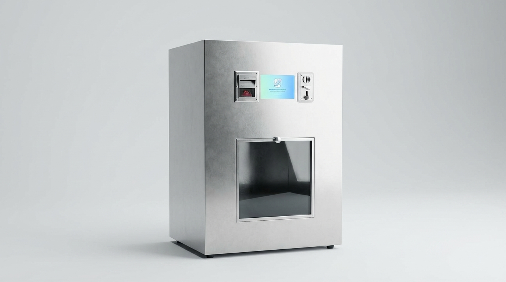

# Smart Shoe Care System

An IoT automated shoe-care kiosk with real-time AI shoe classification, a Next.js web dashboard, and an Android kiosk launcher app.

Customers insert a shoe into the machine, tap through a touchscreen UI to select a service (cleaning, drying, or sterilization), pay via coin/bill acceptor or QR code, and the machine runs the service autonomously. The ESP32-CAM captures an image of the shoe and the Gemini API classifies shoe type and condition in real time.

---

## System Architecture

```
┌─────────────────────────────────────────────────────────┐
│  Android Kiosk App  ◄──── WebView ────►  Next.js Web   │
│  (tablet launcher)                       (kiosk UI)     │
└─────────────────────────────────────────────────────────┘
                              │
                    WebSocket + REST API
                              │
                ┌─────────────────────────┐
                │   Next.js Backend       │
                │   (Node.js + Prisma)    │
                │   PostgreSQL (Neon)     │
                └─────────────────────────┘
                              │
                         WebSocket
                              │
                ┌─────────────────────────┐
                │  ESP32 Main Board       │
                │  (SSCM_MAIN)            │
                │  Motors · Relays · LEDs │
                │  Coin/Bill Acceptor     │
                └─────────────────────────┘
                         ESP-NOW
                              │
                ┌─────────────────────────┐
                │  ESP32-CAM              │
                │  (SSCM_CAM)             │
                │  Shoe image capture     │
                │  HTTP POST → classify   │
                └─────────────────────────┘
```

---

## Sub-Projects

| Directory | Description | README |
|-----------|-------------|--------|
| `firmware/` | ESP32 firmware — main controller (SSCM_MAIN) and camera board (SSCM_CAM) | [firmware/README.md](firmware/README.md) |
| `fullstack/` | Next.js web app — kiosk UI, client dashboard, admin panel, REST + WebSocket API | [fullstack/README.md](fullstack/README.md) |
| `application/` | Android kiosk launcher — locked-down WebView wrapper for the kiosk UI | [application/README.md](application/README.md) |

---

## Key Integrations

| Service | Purpose |
|---------|---------|
| **Google Gemini API** | AI shoe type and condition classification from camera image |
| **PayMongo** | QR code / e-wallet payment processing |
| **Prisma + PostgreSQL** | Database ORM and primary data store (hosted on Neon) |
| **Better Auth** | Authentication for client and admin portals |
| **ESP-NOW** | Low-latency WiFi-based peer-to-peer link between the two ESP32 boards |

---

## Repository Structure

```
smart-shoe-care-system/
├── firmware/                  # ESP32 Arduino firmware
│   ├── SSCM_MAIN/             # Main controller (motors, relays, payment, WebSocket)
│   └── SSCM_CAM/              # Camera board (image capture, HTTP classify)
├── fullstack/                 # Next.js 16 web application + backend
│   ├── src/app/               # App Router pages and API routes
│   ├── prisma/                # Schema and migrations
│   └── server.ts              # Custom Node.js server entry point
├── application/               # Android kiosk launcher (Kotlin)
│   └── app/src/main/          # Kotlin source files
├── docs/                      # Project planning documents
└── .github/workflows/         # CI/CD release workflow
```

---

## CI/CD

Releases are managed via `.github/workflows/release.yml`. The workflow triggers on version tags and produces a GitHub Release.
